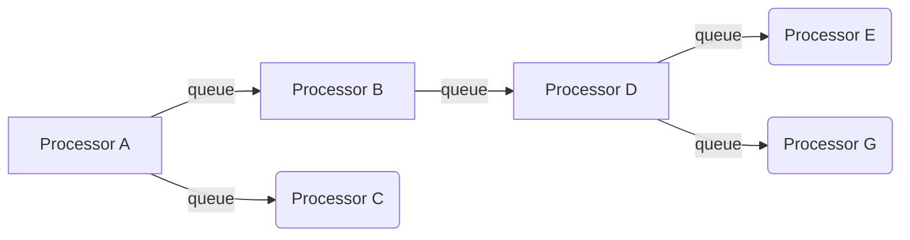

# pifi
The single library allows using directed graphs of data routing, transformation, and mediation logic. In other words, this library is a pico version of [Apache Nifi](https://nifi.apache.org). Why? In real life, there are a ton of use cases or requirements that requires processing data as data flows or streams, splitting the processing into several asynchronous stages and tasks, with a combination of schedulers, etc. And yes, Apache Nifi is a great tool that provides all of these things, but sometimes you can't use it (e.g., an additional component in architecture and infrastructure, resources, complexity, too big for tiny things…). 
But if you want these features, then you can use PIFI ;) The library without dependencies (maybe with one for logging;) ) that can be easy peasy included in any project or deployed to any app server.

### Limitations
- there is no idea to support the process groups, only multiple flows
- remote ports, RPGs


## How it works
The primary component is called a 'processor', which implements the specific business logic (e.g. reading data from the DB, reading files, etc.). Processors are connected through relationships, where each relationship contains one queue where data is stored (output from processors) + logical name and other parameters. When the processor is activated and, e.g. reads one record from the DB, it creates a message called 'flow file'. The flow file is sent (transferred) to a queue for a specific relationship for the destination processor. When the destination processor is ready to accept new tasks, then the processor takes the flow file from the previous queue and executes the required task.




## Requirements
- JDK 1.8
- Maven 3
- eclipse, idea,...

## Current status
- basically, the engine extracted from NIFI but without provenance
- in the following class ```$pifi/src/test/java/com/pifi/demo/PocFlowDemo.java``` , is a basic simple "demo" flow, where are three activities (processors), each of them connected via a relationship, *the idea behind this flow is to read files (polling directory) and process them asynchronously*

## TODO/what's next
- extract provenance
- support routing flowfiles via multiple relationships
- unit tests!!!
- more demos + improve docs
- and more
- github actions + release
